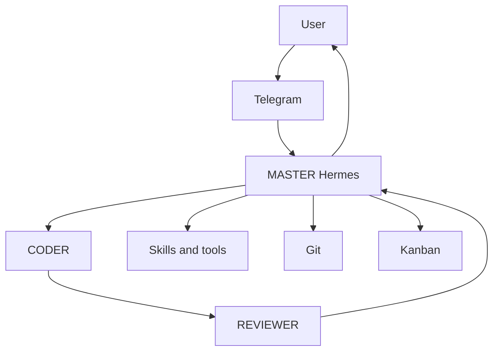

# Orbis AI

Orbis AI is a planned personal AI Control Center. Its first release will use Hermes as the primary orchestrator, Telegram as the remote command interface, and Git for traceable, reversible project work.

This repository is currently **documentation only**. No software, integrations, credentials, or deployments are included.

## Current state

- Phase: **0 — Project Foundation**
- Status: **In progress**
- Next checkpoint: project-owner review of the documentation

## Operating model

## Documentation index

- [Project overview](project-docs/00_PROJECT_OVERVIEW.md)
- [Architecture](project-docs/01_ARCHITECTURE.md)
- [Implementation roadmap](project-docs/02_IMPLEMENTATION_ROADMAP.md)
- [Agent roles](project-docs/03_AGENT_ROLES.md)
- [Security policy](project-docs/04_SECURITY_POLICY.md)
- [Approval policy](project-docs/05_APPROVAL_POLICY.md)
- [Project registry](project-docs/06_PROJECT_REGISTRY.md)
- [Skill architecture](project-docs/07_SKILL_ARCHITECTURE.md)
- [n8n integration](project-docs/08_N8N_INTEGRATION.md)
- [Telegram design](project-docs/09_TELEGRAM_DESIGN.md)
- [Backup and recovery](project-docs/10_BACKUP_RECOVERY.md)
- [Acceptance tests](project-docs/11_TEST_ACCEPTANCE.md)
- [Active task](project-docs/AI_ACTIVE_TASK.md) · [Decisions](project-docs/DECISION_LOG.md) · [Changelog](project-docs/CHANGELOG.md)

## Boundaries

V1 does not include a custom dashboard, large agent fleet, complex model voting or routing, custom memory/Kanban systems, unnecessary custom MCP servers, or production integrations. See the roadmap for the staged scope.

## Git governance

- `main` is the stable, approved, and recoverable branch.
- `develop` is the integration branch.
- Implementation work uses `feature/*`, `ai/codex-*`, or `hotfix/*` branches; significant changes are not made directly on `main` or normally on `develop`.
- Reviewable changes go through a Pull Request targeting `develop`; review approval and merge authorization are separate actions.
- Production or destructive actions require explicit human approval.
