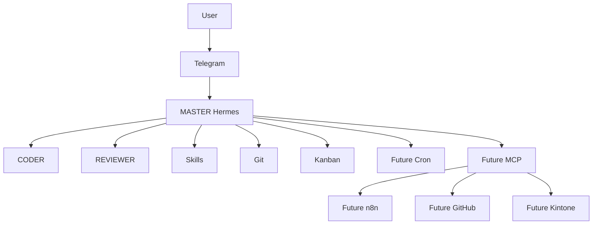

# Architecture

## V1 logical architecture

## Responsibilities at the boundary

Hermes is the primary decision-making and orchestration layer. Telegram only transports authenticated remote commands and responses. n8n, when introduced, handles deterministic workflows and integrations; it is not the AI brain. Git records changes and enables rollback. Kanban provides task state; its product or mechanism is `<TO_BE_DEFINED>`.

## Design constraints

- Start with MASTER, CODER, and REVIEWER only.
- Add capabilities as Skills or Tools unless a distinct agent is justified.
- Keep external integrations least-privileged and read-only first.
- Separate development work from review and production actions.
- Preserve task, approval, and change evidence for audit.

## Explicit V1 exclusions

No custom PWA, 20 Telegram bots, 20+ agents, `/god`, R1–R4 or T0–T4 routing, 23-model voting/model council, custom memory database, custom Kanban, unnecessary custom MCP servers, or Cloudflare Tunnel unless justified later.
