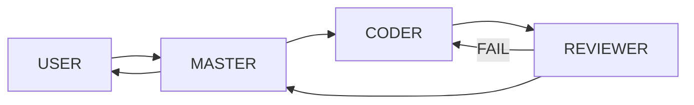

# Implementation Roadmap

| Phase | Outcome | Exit condition |
|---|---|---|
| 0 | Repository, architecture, governance, documentation, Git baseline | Owner approves documentation baseline |
| 1 | Hermes runtime baseline validated on WSL2 Ubuntu | systemd, `hermes doctor`, and basic chat validation pass |
| 2 | Private allowlisted Telegram interface validated on WSL2 | Authorized-user Telegram → Hermes → Telegram round-trip passes |
| 3 | MASTER, CODER, REVIEWER profiles | Role boundaries are exercised |
| 4 | Skill architecture | Initial skills are documented and available |
| 5 | Kanban and handoff | MASTER → CODER → REVIEWER → MASTER flow works |
| 6 | Security gates, approvals, audit logging | Permission and evidence checks work |
| 7 | Project Registry | Registered-project lookup works |
| 8 | n8n via MCP | Read-only capabilities pass testing before writes |
| 9 | Automation/Cron | Approved operational jobs are monitored |
| 10 | Backup/Recovery | Recovery procedure is tested |

## Phase 0 deliverables

The documents in this repository, an initial decision log, a gitignore policy, and a safe-to-initialize repository structure. No implementation work is authorized by Phase 0.

## Validated runtime baseline

**Phase 1 — Complete:** Hermes is operational on WSL2 Ubuntu with systemd. `hermes doctor` and the `ORBIS-WSL-OK` basic chat test passed using the baseline model `stepfun/step-3.7-flash:free`. Windows Native Hermes is retained only as fallback.

**Phase 2 — Complete:** A private, explicitly allowlisted Telegram bot completed validated Telegram → Hermes → Telegram round trips on the WSL2 systemd gateway. `ORBIS-WSL-TELEGRAM-OK`, `TEST-1`, model query, and `ORBIS-READY` passed. The Windows Native Telegram Gateway is not the primary runtime because it was unstable.

**Phase 3 — Complete:** `default` = MASTER, `coder` = CODER, and `reviewer` = REVIEWER. Role boundaries are validated; the MASTER gateway is running, worker gateways are stopped, and Telegram remains MASTER-only.

**Phase 4 — Complete:** The Core Skills `project-manager`, `code-development`, `code-review`, `git-governance`, and `security` are version-controlled, deployed to their intended Hermes profiles, and behaviorally validated. MASTER persistent identity is provided by the default profile `SOUL.md`; Skills provide operating guidance and do not change the active role.

**Phase 5 — Complete:** Kanban and Handoff exit condition is satisfied.

WP-005A and WP-005B completed the required Kanban/Handoff workflow.

WP-005C Backup/Recovery is tracked separately as PARTIAL COMPLETE:
- backup/inventory portions complete
- Restore/DR deferred by Project Owner
- RESTORE_VALIDATION=NOT_STARTED
- MIGRATION=NOT_STARTED
- CUTOVER=NOT_STARTED

GitHub Issues are the canonical task/Kanban source of truth.

**Phase 6 — Complete / Merged:** Security gates, approvals, and audit logging are merged. Governance recovery completed.

**Phase 7 — Complete / Merged:** Project Registry is merged and registered-project lookup works.

**Phase 8 — In Progress / Blocked:** n8n via MCP read-only validation is blocked awaiting a proven local/dev/test n8n environment.

- Planning: COMPLETE / MERGED PR #29
- Read-only inventory/evidence: COMPLETE / MERGED PR #30
- n8n installation/process/configuration: NOT FOUND
- n8n target environment: UNKNOWN
- MCP references in Hermes: FOUND
- MCP runtime capability/version: UNKNOWN
- no `mcp_servers` configured
- n8n connection attempted: NO
- production touched: NO
- write operation executed: NO

Phase 8 exit condition:
A proven LOCAL/DEV/TEST n8n environment must exist before read-only MCP validation may continue.

Phase 8 gate:
WP-008 SAFE N8N SANDBOX PROVISIONING — NON-PRODUCTION ONLY is the next safe work package. SANDBOX_PROVISIONING_STARTED=NO.

**Phase 9 — Not Started:** Automation/Cron.

**Backup/Recovery — Partial Complete:**
- runtime inventory / backup design = COMPLETE
- external credential recovery verification = COMPLETE
- backup execution / manifest validation = COMPLETE
- Restore/DR validation = DEFERRED BY PROJECT OWNER

RESTORE_VALIDATION=NOT_STARTED
MIGRATION=NOT_STARTED
CUTOVER=NOT_STARTED

Do not claim full DR validation.

- WP-005A: GitHub-Issue-based task state, handoff protocol, Issue template, governance, and Core Skill guidance.
- WP-005B: Hermes runtime integration plus optional Hermes Desktop operator console connected to the existing WSL2 Hermes runtime.
- WP-005C: end-to-end MASTER → CODER → REVIEWER → Control Plane workflow, FAIL return loop, Telegram/Desktop access, and restart/resume validation. Restore/DR rehearsal was part of WP-005C scope but was DEFERRED BY PROJECT OWNER and is NOT STARTED.

Hermes Desktop must not create a separate Orbis runtime. GitHub Issues remain the canonical task/Kanban source of truth.

## Skills

**Phase 4 Core:** `project-manager`, `code-development`, `code-review`, `git-governance`, and `security`.

**Deferred:** `n8n` remains Phase 8 scope; `kintone` remains future approved integration scope; project-specific Skills such as `MBO2026`, `OrgFlow`, and `COCE` require separate authorization.

## Handoff flow

