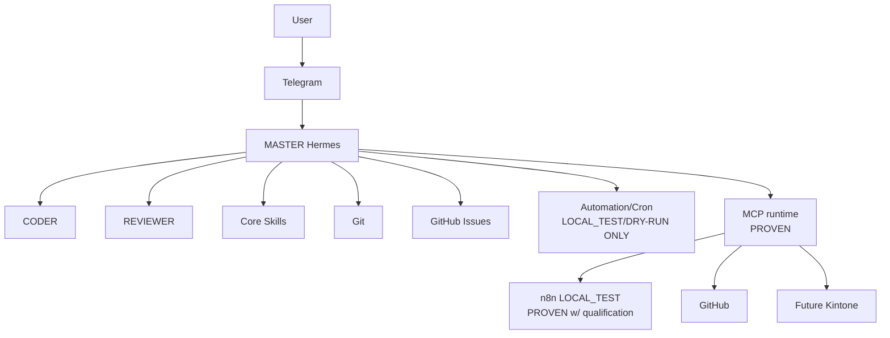

# Architecture

## V1 logical architecture — current state

## Operating boundaries

| Capability | State | Boundary |
|---|---|---|
| MCP runtime | PROVEN | Read-only/planned integrations only unless explicitly authorized |
| Automation/Cron | VALIDATED IN LOCAL_TEST/DRY-RUN ONLY | Production automation NOT AUTHORIZED |
| n8n | LOCAL_TEST PROVEN WITH QUALIFICATION | Production integration NOT COMPLETE; writes NOT AUTHORIZED |
| Kintone | Future approved integration | NOT IMPLEMENTED |
| Telegram | WSL2 systemd gateway primary; Windows Native fallback | No production credential exposure; do not elevate authority |
| Hermes Desktop | Operator UI only | Must connect to existing Primary WSL2 runtime; must not create a duplicate runtime |
| GitHub Issues | Canonical task/Kanban store | Write actions blocked by missing/ambiguous registry until Owner clarifies |

## Responsibilities at the boundary

Hermes is the primary decision-making and orchestration layer. Telegram only transports authenticated remote commands and responses. n8n handles deterministic workflows and integrations; current validation is LOCAL_TEST with qualification and production integration remains NOT COMPLETE. It is not the AI brain. Git records changes and enables rollback. GitHub Issues are the canonical task store: Issue labels represent Kanban state and current responsibility, while Issue comments retain handoff and audit evidence. No custom Kanban database or web application is required.

## Design constraints

- Start with MASTER, CODER, and REVIEWER only.
- Add capabilities as Skills or Tools unless a distinct agent is justified.
- Keep external integrations least-privileged and read-only first.
- Separate development work from review and production actions.
- Preserve task, approval, and change evidence for audit.
- Hermes Desktop is operator UI only; it must not create a separate Orbis runtime.
- Primary Hermes runtime is WSL2 Ubuntu; Windows Native Hermes/Gateway is fallback only.

## Explicit V1 exclusions

No custom PWA, 20 Telegram bots, 20+ agents, `/god`, R1–R4 or T0–T4 routing, 23-model voting/model council, custom memory database, custom Kanban, unnecessary custom MCP servers, or Cloudflare Tunnel unless justified later.
