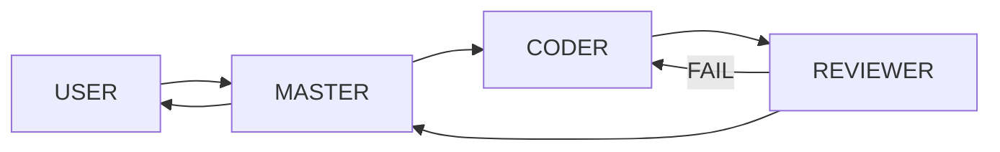

# Implementation Roadmap

| Phase | Outcome | Exit condition |
|---|---|---|
| 0 | Repository, architecture, governance, documentation, Git baseline | Owner approves documentation baseline |
| 1 | Hermes runtime baseline validated on WSL2 Ubuntu | systemd, `hermes doctor`, and basic chat validation pass |
| 2 | Private allowlisted Telegram interface validated on WSL2 | Authorized-user Telegram → Hermes → Telegram round-trip passes |
| 3 | MASTER, CODER, REVIEWER profiles | Role boundaries are exercised |
| 4 | Skill architecture | Initial skills are documented and available |
| 5 | Kanban and handoff | MASTER → CODER → REVIEWER → MASTER flow works |
| 6 | Security gates, approvals, audit logging | Permission and evidence checks work |
| 7 | Project Registry | Registered-project lookup works |
| 8 | n8n via MCP | Read-only capabilities pass testing before writes |
| 9 | Automation/Cron | Approved operational jobs are monitored |
| 10 | Backup/Recovery | Recovery readiness proven for current scope; migration/cutover deferred |

## Phase 0 deliverables

The documents in this repository, an initial decision log, a gitignore policy, and a safe-to-initialize repository structure. No implementation work is authorized by Phase 0.

## Validated runtime baseline

**Phase 1 — Complete:** Hermes is operational on WSL2 Ubuntu with systemd. `hermes doctor` and the `ORBIS-WSL-OK` basic chat test passed using the baseline model `stepfun/step-3.7-flash:free`. Windows Native Hermes is retained only as fallback.

**Phase 2 — Complete:** A private, explicitly allowlisted Telegram bot completed validated Telegram → Hermes → Telegram round trips on the WSL2 systemd gateway. `ORBIS-WSL-TELEGRAM-OK`, `TEST-1`, model query, and `ORBIS-READY` passed. The Windows Native Telegram Gateway is not the primary runtime because it was unstable.

**Phase 3 — Complete:** `default` = MASTER, `coder` = CODER, and `reviewer` = REVIEWER. Role boundaries are validated; the MASTER gateway is running, worker gateways are stopped, and Telegram remains MASTER-only.

**Phase 4 — Complete:** The Core Skills `project-manager`, `code-development`, `code-review`, `git-governance`, and `security` are version-controlled, deployed to their intended Hermes profiles, and behaviorally validated. MASTER persistent identity is provided by the default profile `SOUL.md`; Skills provide operating guidance and do not change the active role.

**Phase 5 — Complete:** Kanban and Handoff exit condition is satisfied.

WP-005A and WP-005B completed the required Kanban/Handoff workflow.

WP-005C Backup/Recovery is tracked separately as COMPLETE FOR CURRENT RECOVERY SCOPE:
- backup/inventory portions complete
- isolated restore rehearsal / recovery validation = PASS
- corrective backup coverage complete
- Restore/DR validation = PASS
- recovery readiness = PROVEN
- Migration = DEFERRED / NOT_STARTED
- Cutover = DEFERRED / NOT_STARTED

Do not claim migration or cutover readiness has been executed.

**Phase 6 — Complete / Merged:** Security gates, approvals, and audit logging are merged. Governance recovery completed.

**Phase 7 — Complete / Merged:** Project Registry is merged and registered-project lookup works.

**Phase 8 — Complete With Qualification:** n8n via MCP read-only validation is complete with Owner-accepted empty-sandbox qualification.

- Planning: COMPLETE / MERGED PR #29
- Read-only inventory/evidence: COMPLETE / MERGED PR #30
- MCP runtime/evidence: COMPLETE / MERGED PR #35
- Closeout: COMPLETE / MERGED PR #36 → `75bd715d6ce07d86ae38bee617288d7973a546f5`
- n8n installation/process/configuration: LOCAL_TEST sandbox provisioned and proven at 127.0.0.1:5678 (n8n 2.36.9)
- n8n target environment: LOCAL_TEST
- MCP runtime in Hermes: PROVEN
- MCP package/distribution/version: mcp 2.0.0 + mcp-types 2.0.0
- configured MCP servers: none
- n8n connection attempted: NO
- production touched: NO
- write operation executed: NO

Phase 8 exit condition:
EMPTY-SANDBOX READ OPERATIONS = NOT TESTABLE WITHOUT WRITE — OWNER ACCEPTED.

Phase 8 gate:
Write-capable phases remain NOT AUTHORIZED.
Production n8n integration remains NOT COMPLETE.

**Phase 9 — Complete With Qualification:** Automation/Cron implementation is complete within LOCAL_TEST / DRY-RUN ONLY scope.

- Planning: COMPLETE / MERGED PR #38
- Implementation: COMPLETE / MERGED PR #40
- PR #40 merge commit: `4722ca6e2330c517b8bff1e5280b452e8f2f134f`
- Issue #39: CLOSED / COMPLETED
- LOCAL_TEST health: FAIL / HTTP 000 — sandbox unreachable; qualification retained
- n8n writes: NOT AUTHORIZED
- production automation: NOT AUTHORIZED
- external side effects: NONE
- Phase 10: COMPLETE FOR CURRENT SCOPE

**Backup/Recovery — Complete for current scope:**
- runtime inventory / backup design = COMPLETE
- external credential recovery verification = COMPLETE
- backup execution / manifest validation = COMPLETE
- isolated restore rehearsal / recovery validation = PASS
- corrective backup coverage = COMPLETE
- original accepted backup preserved: `20260830-231125`
- corrective backup: `20260830-231125-corrective`
- recovery readiness = PROVEN

RESTORE_VALIDATION=PASS
MIGRATION=DEFERRED / NOT_STARTED
CUTOVER=DEFERRED / NOT_STARTED

Do not claim migration or cutover readiness has been executed.

- WP-005A: GitHub-Issue-based task state, handoff protocol, Issue template, governance, and Core Skill guidance.
- WP-005B: Hermes runtime integration plus optional Hermes Desktop operator console connected to the existing WSL2 Hermes runtime.
- WP-005C: end-to-end MASTER → CODER → REVIEWER → Control Plane workflow,
  FAIL return loop, Telegram/Desktop access, restart/resume validation,
  backup/recovery inventory and execution evidence.
- Phase 10 later completed the isolated restore rehearsal and validation.
- RESTORE_VALIDATION=PASS.
- Migration/Cutover remain DEFERRED / NOT_STARTED.

Hermes Desktop must not create a separate Orbis runtime. GitHub Issues remain the canonical task/Kanban source of truth.

## Skills

**Phase 4 Core:** `project-manager`, `code-development`, `code-review`, `git-governance`, and `security`.

**Current n8n/skills status:**
- Phase 8 n8n integration validation is COMPLETE WITH QUALIFICATION; production/write-capable n8n remains NOT AUTHORIZED.
- Kintone and project-specific Skills remain future separately-authorized work.

## Handoff flow

